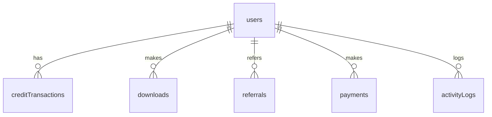

# CRMedia Bot

> **A production-ready media download platform** with free and credit-based modes, referral rewards, payment integration, and a full admin dashboard.


---

## What is CRMedia Bot?

CRMedia Bot is a **media downloading platform** that supports YouTube, Instagram, TikTok, Twitter/X, Facebook, and direct links. It features:

- **Free Mode** — Unlimited downloads with no credits required
- **Credit Mode** — Pay-per-download with weekly top-ups, referrals, and credit purchases
- **Admin Dashboard** — Full analytics, user management, settings control
- **Referral System** — Earn bonus credits by inviting friends
- **Payment Integration** — Purchase credits via Telegram, PayPal, or crypto

## Tech Stack

| Layer | Technology |
|-------|-----------|
| Frontend | React 19 + TypeScript + Vite 7 |
| UI Components | shadcn/ui + Tailwind CSS 4 |
| Animation | Framer Motion 12 |
| Backend/Database | Convex (serverless) |
| Auth | @convex-dev/auth (Email OTP + Anonymous) |
| Routing | React Router 7 |
| Charts | Recharts |
| Forms | React Hook Form + Zod |

## Quick Start

### Prerequisites

- **Node.js 20+** — [Install](https://nodejs.org/)
- **npm 10+** — Comes with Node.js
- **Convex Account** — [Sign up free](https://convex.dev)

### 1. Clone & Setup

```bash
git clone https://github.com/your-org/crmedia-bot.git
cd crmedia-bot
chmod +x setup.sh deploy.sh
./setup.sh
```

### 2. Configure Environment

Edit `.env` with your Convex credentials:

```env
VITE_CONVEX_URL=https://your-deployment.convex.cloud
```

> Get this URL from your Convex dashboard after running `npx convex dev`.

### 3. Start Development

**Terminal 1 — Backend:**
```bash
npx convex dev
```

**Terminal 2 — Frontend:**
```bash
npm run dev
```

Open **http://localhost:5173** in your browser.

### 4. First-Time Setup

1. Sign in via the Auth page (Email OTP or Guest)
2. Navigate to `/admin`
3. Click "Init Packages" to create default credit packages
4. Promote yourself to admin in the Convex dashboard:
   ```typescript
   // In Convex dashboard Functions tab, run:
   await ctx.runMutation(api.admin.promoteToAdmin, {
     userId: "your_user_id"
   });
   ```

---

## Project Structure

```
crmedia-bot/
├── src/
│   ├── convex/                # Backend (Convex functions)
│   │   ├── schema.ts          # Database schema (8 tables)
│   │   ├── users.ts           # User management
│   │   ├── credits.ts         # Credit system
│   │   ├── downloads.ts       # Download management
│   │   ├── referrals.ts       # Referral system
│   │   ├── payments.ts        # Payment handling
│   │   ├── settings.ts        # Bot configuration
│   │   └── admin.ts           # Admin operations
│   ├── pages/                 # Frontend pages
│   │   ├── Landing.tsx        # Marketing landing page
│   │   ├── Auth.tsx           # Sign in / sign up
│   │   ├── Dashboard.tsx      # User dashboard
│   │   └── Admin.tsx          # Admin dashboard
│   ├── components/            # Reusable components
│   │   └── ui/                # shadcn/ui (40+ components)
│   ├── hooks/                 # Custom React hooks
│   └── lib/                   # Utilities
├── ai-chat/kb/                # Knowledge base documentation
├── ansible/                   # Ansible deployment
│   ├── deploy.yml             # Main playbook
│   ├── inventory.ini          # Server inventory
│   └── templates/             # Nginx config template
├── crmedia-bot/               # Python Telegram bot (planned)
├── setup.sh                   # Local dev setup script
├── deploy.sh                  # Production deploy script
├── Dockerfile                 # Docker build
├── docker-compose.yml         # Docker Compose config
└── README.md                  # This file
```

---

## Deployment

### Option 1: Bash Script (Manual)

```bash
# Development setup
./setup.sh

# Production deployment
export CONVEX_DEPLOY_KEY="your-key"
export VITE_CONVEX_URL="https://your-convex.convex.cloud"
./deploy.sh
```

### Option 2: Ansible (Automated)

```bash
# Edit ansible/inventory.ini with your server details
# Set convex_deploy_key and vite_convex_url

ansible-playbook -i ansible/inventory.ini ansible/deploy.yml
```

### Option 3: Docker

```bash
# Build and run
VITE_CONVEX_URL=https://your-convex.convex.cloud docker compose up -d

# Or without compose
docker build -t crmedia-bot .
docker run -p 80:80 -e VITE_CONVEX_URL=... crmedia-bot
```

### Option 4: Vercel / Netlify

1. Push to GitHub
2. Connect repo to Vercel/Netlify
3. Set `VITE_CONVEX_URL` as an environment variable
4. Deploy

---

## Database Schema



**8 Tables:** `users`, `creditTransactions`, `downloads`, `referrals`, `payments`, `creditPackages`, `botSettings`, `activityLogs`

Full schema documentation: [`ai-chat/kb/01-schema.md`](./ai-chat/kb/01-schema.md)

---

## API Reference

All backend functions are exposed via Convex queries and mutations:

| Module | Key Functions |
|--------|--------------|
| **Users** | `currentUser`, `ensureProfile`, `updateProfile` |
| **Credits** | `getBalance`, `getTransactions`, `spendCredits`, `addCredits`, `switchMode` |
| **Downloads** | `createDownload`, `getMyDownloads`, `getAllDownloads`, `updateDownloadStatus` |
| **Referrals** | `generateReferralCode`, `applyReferralCode`, `getMyReferrals` |
| **Payments** | `createPayment`, `completePayment`, `getMyPayments`, `refundPayment` |
| **Settings** | `getSettings`, `updateSettings`, `getCreditPackages` |
| **Admin** | `isAdmin`, `getAllUsers`, `getAnalytics`, `adjustUserCredits`, `setUserMode` |

Full API documentation: [`ai-chat/kb/`](./ai-chat/kb/)

---

## Business Rules

### Download Modes

```
IF freeModeEnabled (global) = true
  → ALL users download for free
ELSE
  → Check individual user mode ("free" or "credit")
  → Credit mode requires sufficient balance
```

### Referral Bonuses

- **Referrer** earns 5 credits (configurable)
- **Referred user** earns 3 credits (configurable)
- One referral per user, no self-referrals

### Credit Packages

| Package | Credits | Price |
|---------|---------|-------|
| Starter | 50 | $2.99 |
| Popular | 150 | $7.99 |
| Pro | 500 | $19.99 |
| Enterprise | 2000 | $59.99 |

---

## Environment Variables

| Variable | Required | Description |
|----------|----------|-------------|
| `VITE_CONVEX_URL` | ✅ | Convex deployment URL |
| `VITE_VLY_APP_ID` | ❌ | Vly monitoring app ID |
| `VITE_VLY_MONITORING_URL` | ❌ | Vly monitoring URL |
| `CONVEX_DEPLOY_KEY` | ✅ (deploy) | Convex deploy key for CI/CD |
| `CONVEX_DEPLOYMENT` | ✅ (deploy) | Convex deployment identifier |

---

## Documentation

Complete knowledge base in [`ai-chat/kb/`](./ai-chat/kb/):

| Document | Description |
|----------|-------------|
| [Architecture](./ai-chat/kb/00-architecture.md) | System design, tech stack, diagrams |
| [Schema](./ai-chat/kb/01-schema.md) | All 8 database tables |
| [Users](./ai-chat/kb/02-backend-users.md) | User backend functions |
| [Credits](./ai-chat/kb/03-backend-credits.md) | Credit system |
| [Downloads](./ai-chat/kb/04-backend-downloads.md) | Download management |
| [Referrals](./ai-chat/kb/05-backend-referrals.md) | Referral system |
| [Payments](./ai-chat/kb/06-backend-payments.md) | Payment handling |
| [Settings](./ai-chat/kb/07-backend-settings.md) | Bot configuration |
| [Admin](./ai-chat/kb/08-backend-admin.md) | Admin operations |
| [Landing](./ai-chat/kb/09-frontend-landing.md) | Landing page |
| [Dashboard](./ai-chat/kb/10-frontend-dashboard.md) | User dashboard |
| [Admin UI](./ai-chat/kb/11-frontend-admin.md) | Admin dashboard |
| [Auth](./ai-chat/kb/12-auth-flow.md) | Authentication flow |
| [Business Logic](./ai-chat/kb/13-business-logic.md) | Rules and decision trees |
| [Pending Work](./ai-chat/kb/14-pending-work.md) | What's done vs planned |

---

## License

MIT

---

*Built with ❤️ using React, Convex, and shadcn/ui*
