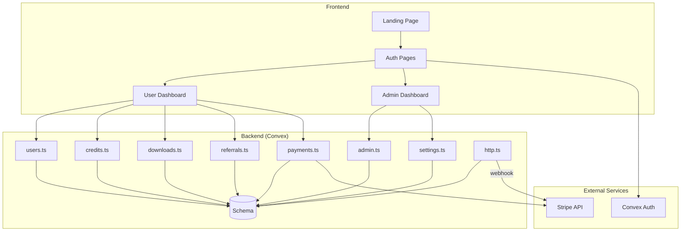
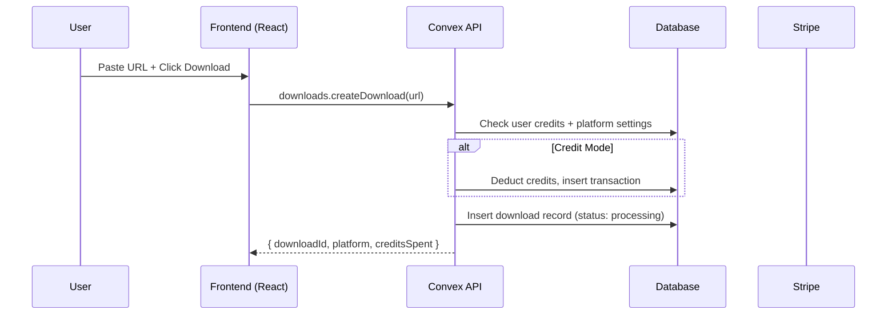
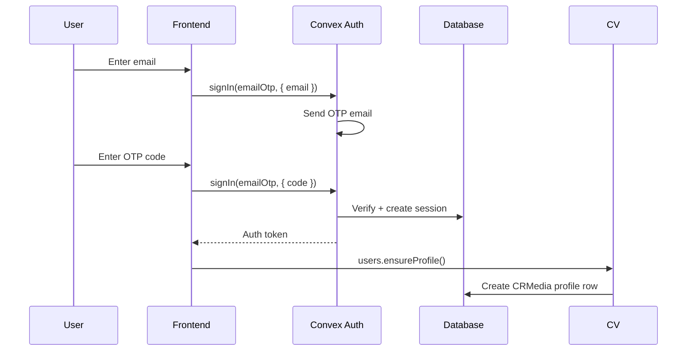

# CRMedia Bot — System Architecture

## 1. Goal & Scope

CRMedia Bot is a production-ready media download platform supporting YouTube, Instagram, TikTok, Twitter/X, Facebook, and direct links. It provides a dual-mode system (free/credit), referral rewards, Stripe payments, and full admin controls — accessible via web UI, Telegram bot, and REST API.

This document describes the high-level system architecture, tech stack, data flow, and deployment topology.

## 2. Architecture Visuals

### System Overview



### Data Flow



### Auth Flow



### Role Hierarchy

```
super_admin  ──  Full system access, server config, user management
admin        ──  View analytics, manage users, adjust credits
user         ──  Normal user (free or credit mode)
member       ──  Alias for user (Convex Auth default)
```

## 3. Code References

| Component | File Path | Key Functions/Exports |
|-----------|-----------|----------------------|
| Schema | `src/convex/schema.ts` | `ROLES`, `roleValidator`, `defineSchema(...)` |
| Users | `src/convex/users.ts` | `currentUser`, `ensureProfile`, `getProfile`, `updateProfile`, `linkTelegram`, `touchLastSeen` |
| Credits | `src/convex/credits.ts` | `getBalance`, `getTransactions`, `spendCredits`, `addCredits`, `switchMode`, `weeklyTopUp`, `adminAdjustCredits` |
| Downloads | `src/convex/downloads.ts` | `createDownload`, `getMyDownloads`, `getAllDownloads`, `detectPlatform()` |
| Referrals | `src/convex/referrals.ts` | `generateCode`, `applyReferralCode`, `getMyReferrals`, `getAllReferrals` |
| Payments | `src/convex/payments.ts` | `createCheckoutSession`, `confirmPayment`, `failPayment`, `getMyPayments`, `getAllPayments`, `handleStripeWebhook` |
| Settings | `src/convex/settings.ts` | `initSettings`, `getSettings`, `updateSettings`, `getCreditPackages`, `initCreditPackages`, `getSetting` |
| Admin | `src/convex/admin.ts` | `isAdmin`, `isSuperAdmin`, `getAnalytics`, `getAllUsers`, `adjustUserCredits`, `manageUserRole`, `getSystemConfig`, `getActivityLogs` |
| HTTP | `src/convex/http.ts` | Stripe webhook route `/api/stripe-webhook` |
| Auth Config | `src/convex/auth.ts` | `auth`, `signIn`, `signOut`, `store`, `isAuthenticated` |
| Auth Hook | `src/hooks/use-auth.ts` | `useAuth()` → `{ isLoading, isAuthenticated, user, signIn, signOut }` |
| Landing | `src/pages/Landing.tsx` | Hero, platforms, features, pricing, CTA sections |
| Dashboard | `src/pages/Dashboard.tsx` | Sidebar layout, OverviewTab, DownloadsTab, CreditsTab, ReferralsTab, PackagesTab, SettingsTab |
| Admin | `src/pages/Admin.tsx` | Sidebar layout, OverviewTab, UsersTab, DownloadsTab, PaymentsTab, SettingsTab, SystemTab, ActivityTab |
| Stripe | `src/components/StripeCheckout.tsx` | `StripeCheckout` dialog with `CheckoutForm` (Stripe Elements) |
| Main | `src/main.tsx` | Routes: `/`, `/auth`, `/dashboard`, `/admin` |

## 4. Tech Stack

| Layer | Technology | Version |
|-------|-----------|---------|
| Frontend | React + TypeScript + Vite | 19 / 5.9 / 7 |
| UI | shadcn/ui + Tailwind CSS + Framer Motion | — / 4 / 12 |
| Backend | Convex (serverless) | Latest |
| Auth | @convex-dev/auth | Latest |
| Payments | Stripe (@stripe/stripe-js + @stripe/react-stripe-js) | Latest |
| Routing | react-router | v7 |
| Deployment | Docker / Ansible / Manual | — |

## 5. Edge Cases & Failure Modes

| Scenario | Behavior | Code Reference |
|----------|----------|----------------|
| Unauthenticated user | Returns `null` or throws "Not authenticated" | All `getAuthUserId(ctx)` checks |
| Insufficient credits (credit mode) | Throws descriptive error with current/needed balance | `credits.ts::spendCredits` |
| Platform disabled | Throws "X downloads are currently disabled" | `downloads.ts::createDownload` |
| Duplicate referral | Throws "You have already been referred" | `referrals.ts::applyReferralCode` |
| Self-referral | Throws "Cannot use your own referral code" | `referrals.ts::applyReferralCode` |
| Payment already completed | Returns `{ already: true }` (idempotent) | `payments.ts::confirmPayment` |
| Non-admin accessing admin routes | Redirected to `/dashboard` | `Admin.tsx` useEffect |
| Stripe webhook verification | Currently simulated; production needs signature verification | `http.ts` comments |
| Convex codegen stale types | Run `npx convex dev --once` to regenerate | `src/convex/_generated/*` |
