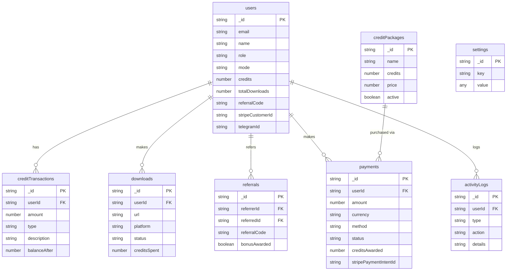

# CRMedia Bot — Database Schema

## 1. Goal & Scope

Defines the Convex database schema for CRMedia Bot — 8 tables covering user accounts, credit transactions, downloads, referrals, payments, settings, credit packages, and activity logs. This is the single source of truth for all data structures.

## 2. Architecture Visuals

### Entity Relationship

## 3. Code References

All tables defined in: `src/convex/schema.ts`

## 4. Table Definitions

### Table: users
**File:** `src/convex/schema.ts` lines 36-63

| Field | Type | Default | Description |
|-------|------|---------|-------------|
| `_id` | `Id<"users">` | auto | Convex auth user ID (from `authTables`) |
| `name` | `string?` | — | Display name |
| `image` | `string?` | — | Profile image URL |
| `email` | `string?` | — | Email address |
| `emailVerificationTime` | `number?` | — | When email was verified |
| `isAnonymous` | `boolean?` | — | Anonymous auth flag |
| `role` | `Role?` | — | "user" / "admin" / "super_admin" / "member" |
| `credits` | `number` | 10 | Current credit balance |
| `mode` | `"free" \| "credit"` | "free" | Download mode |
| `referralCode` | `string?` | auto-generated | Unique 8-char referral code |
| `referredBy` | `string?` | — | Referral code used |
| `stripeCustomerId` | `string?` | — | Stripe customer ID |
| `telegramId` | `string?` | — | Telegram user ID |
| `telegramUsername` | `string?` | — | Telegram username |
| `language` | `string?` | "en" | UI language |
| `platform` | `string?` | "web" | Registration platform |
| `firstSeen` | `number` | Date.now() | First login timestamp |
| `lastSeen` | `number` | Date.now() | Last activity timestamp |
| `totalDownloads` | `number` | 0 | Lifetime download count |
| `totalCreditsSpent` | `number` | 0 | Lifetime credits spent |
| `weeklyTopupLastAt` | `number?` | — | Last weekly top-up timestamp |

**Indexes:** `email`, `by_referralCode`, `by_stripeCustomerId`, `by_telegramId`, `by_role`

### Table: creditTransactions
**File:** `src/convex/schema.ts` lines 68-83

| Field | Type | Description |
|-------|------|-------------|
| `userId` | `string` | Owner user ID |
| `amount` | `number` | +positive (credit) or -negative (debit) |
| `type` | `union` | "spend" / "topup" / "referral_bonus" / "purchase" / "admin_adjustment" / "weekly_topup" |
| `description` | `string` | Human-readable reason |
| `balanceAfter` | `number` | Balance after this transaction |
| `referenceId` | `string?` | Related entity ID (payment, download, etc.) |

**Index:** `by_userId`

### Table: downloads
**File:** `src/convex/schema.ts` lines 86-103

| Field | Type | Description |
|-------|------|-------------|
| `userId` | `string` | Owner user ID |
| `url` | `string` | Source URL |
| `platform` | `string` | "youtube" / "instagram" / "tiktok" / "twitter" / "facebook" / "other" |
| `title` | `string?` | Media title |
| `thumbnail` | `string?` | Thumbnail URL |
| `status` | `union` | "pending" / "processing" / "completed" / "failed" |
| `creditsSpent` | `number` | Credits consumed |
| `quality` | `string?` | Quality setting |
| `downloadUrl` | `string?` | Final download URL |
| `fileSize` | `number?` | File size in bytes |
| `error` | `string?` | Error message if failed |

**Indexes:** `by_userId`, `by_status`, `by_platform`

### Table: referrals
**File:** `src/convex/schema.ts` lines 106-118

| Field | Type | Description |
|-------|------|-------------|
| `referrerId` | `string` | Who referred (user ID) |
| `referredId` | `string` | Who was referred (user ID) |
| `referralCode` | `string` | Code used |
| `bonusAwarded` | `boolean` | Whether referrer bonus was given |
| `referredBonusAwarded` | `boolean` | Whether referred bonus was given |

**Indexes:** `by_referrerId`, `by_referredId`, `by_referralCode`

### Table: payments
**File:** `src/convex/schema.ts` lines 121-139

| Field | Type | Description |
|-------|------|-------------|
| `userId` | `string` | Buyer user ID |
| `amount` | `number` | Payment amount in dollars |
| `currency` | `string` | Currency code (e.g., "USD") |
| `method` | `union` | "stripe" / "telegram" / "paypal" / "crypto" |
| `status` | `union` | "pending" / "completed" / "failed" / "refunded" |
| `creditsAwarded` | `number` | Credits to give on completion |
| `packageName` | `string?` | Package name |
| `packageId` | `string?` | Credit package ID |
| `stripePaymentIntentId` | `string?` | Stripe PaymentIntent ID |
| `stripeSessionId` | `string?` | Stripe Checkout Session ID |
| `metadata` | `string?` | Extra JSON data |

**Indexes:** `by_userId`, `by_stripePaymentIntentId`, `by_stripeSessionId`, `by_status`

### Table: settings
**File:** `src/convex/schema.ts` lines 142-148

| Field | Type | Description |
|-------|------|-------------|
| `key` | `string` | Setting name (unique) |
| `value` | `boolean \| number \| string \| string[]` | Setting value |
| `description` | `string?` | Human-readable description |

**Index:** `by_key`

### Table: creditPackages
**File:** `src/convex/schema.ts` lines 68-78

| Field | Type | Description |
|-------|------|-------------|
| `name` | `string` | Package name ("Starter", "Popular", "Pro", "Enterprise") |
| `credits` | `number` | Credits in package |
| `price` | `number` | Price in dollars |
| `currency` | `string` | Currency code |
| `badge` | `string?` | Display badge ("Best Value", etc.) |
| `stripePriceId` | `string?` | Stripe Price ID |
| `active` | `boolean` | Available for purchase |
| `sortOrder` | `number` | Display order |

**Index:** `by_active`

### Table: activityLogs
**File:** `src/convex/schema.ts` lines 151-163

| Field | Type | Description |
|-------|------|-------------|
| `userId` | `string?` | Who performed action |
| `action` | `string` | Short action name |
| `details` | `string?` | Full description |
| `type` | `union` | "download" / "purchase" / "referral" / "credit_adjust" / "login" / "mode_switch" / "admin_action" / "system" |
| `metadata` | `string?` | Extra JSON data |

**Indexes:** `by_type`, `by_userId`

## 5. Edge Cases & Failure Modes

| Scenario | Behavior |
|----------|----------|
| Missing auth tables | `authTables` from `@convex-dev/auth/server` must not be removed |
| Invalid enum value | Convex validators reject at write time (strict unions) |
| Large `settings.value` | Union type limits to boolean/number/string/string[] |
| `creditTransactions` without `balanceAfter` | Schema requires it — always compute before insert |
| `referrals` duplicate | `by_referredId` index + application logic prevents duplicates |
| Schema validation disabled | `schemaValidation: false` set in schema config |
