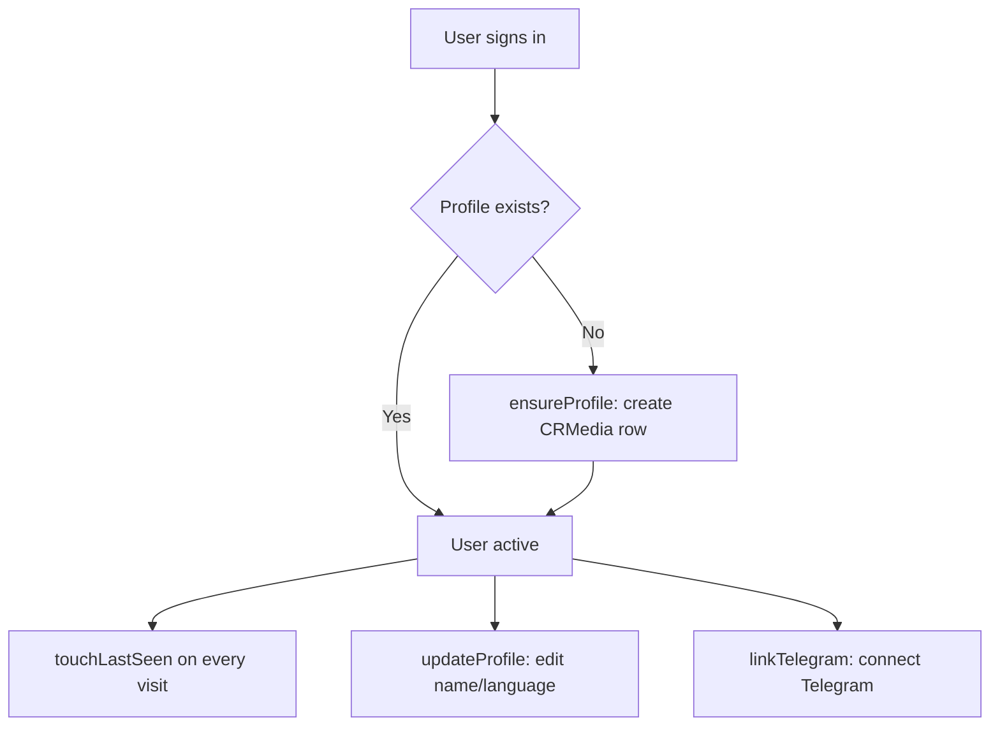
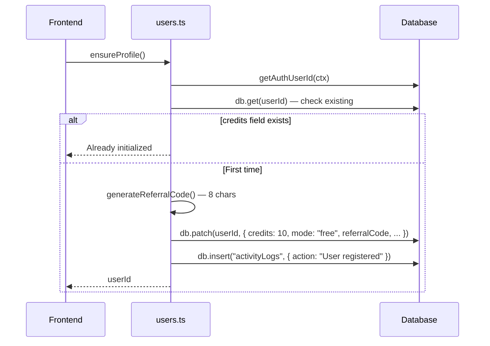

# CRMedia Bot — Users Backend

## 1. Goal & Scope

Manages user profiles, authentication state, Telegram linking, and activity tracking. The users module is the foundation — every other module depends on user records existing in the `users` table.

## 2. Architecture Visuals

### User Lifecycle

### Profile Initialization Flow

## 3. Code References

**File:** `src/convex/users.ts`

| Function | Type | Args | Returns | Description |
|----------|------|------|---------|-------------|
| `currentUser` | query | `{}` | `User \| null` | Get current user profile |
| `getCurrentUser` | helper | `ctx` | `User \| null` | Internal helper for current user |
| `ensureProfile` | mutation | `{}` | `Id<"users">` | Create CRMedia profile if first login |
| `getProfile` | query | `{}` | `User \| null` | Full profile for current user |
| `updateProfile` | mutation | `{ name?, language? }` | `Id<"users">` | Update profile fields |
| `linkTelegram` | mutation | `{ telegramId, telegramUsername? }` | `Id<"users">` | Connect Telegram account |
| `touchLastSeen` | mutation | `{}` | `void` | Update lastSeen timestamp |
| `generateReferralCode` | helper | — | `string` | Generate 8-char alphanumeric code |

## 4. Edge Cases & Failure Modes

| Scenario | Behavior | Code Reference |
|----------|----------|----------------|
| Unauthenticated call | Throws "Not authenticated" | All mutations check `getAuthUserId(ctx)` |
| User not in auth table | Throws "User not found in auth table" | `ensureProfile` line 19 |
| Already initialized | Returns existing `_id` (idempotent) | `ensureProfile` line 17 |
| Referral code collision | Not handled — random generation | `generateReferralCode` |
| Patching non-existent field | Convex ignores unknown fields silently | `db.patch()` behavior |
