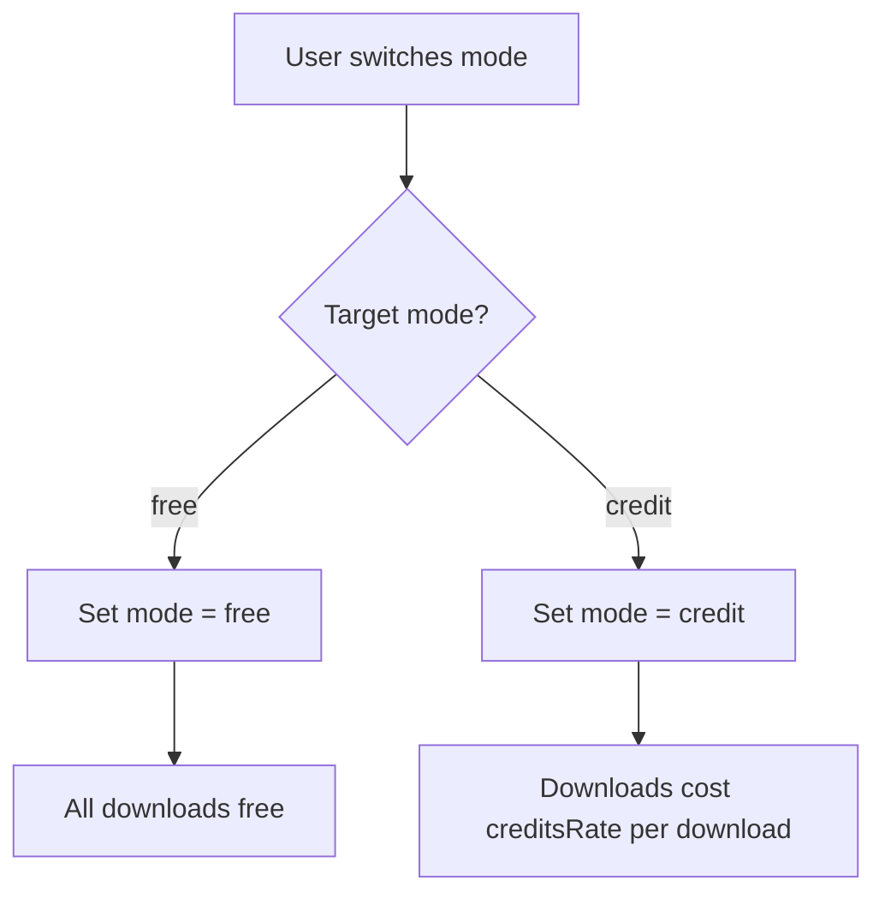
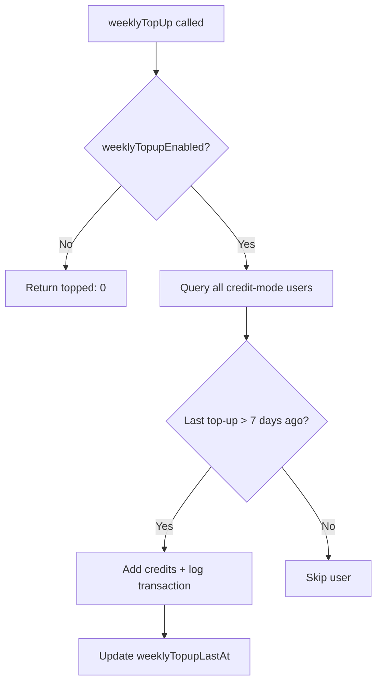

# CRMedia Bot — Credits Backend

## 1. Goal & Scope

Manages the credit economy: balance queries, spending, earning, mode switching, weekly top-ups, and admin adjustments. Credits are the core business metric — they control download access in credit mode.

## 2. Architecture Visuals

### Credit Flow

```mermaid
flowchart LR
    subgraph "Credit Sources"
        A[Weekly Top-up] --> BALANCE
        B[Referral Bonus] --> BALANCE
        C[Stripe Purchase] --> BALANCE
        D[Admin Adjustment] --> BALANCE
    end

    subgraph "Credit Sinks"
        BALANCE --> E[Download (credit mode)]
    end

    BALANCE[(Credit Balance)]
```

### Mode Switching



### Weekly Top-Up Flow



## 3. Code References

**File:** `src/convex/credits.ts`

| Function | Type | Args | Returns | Description |
|----------|------|------|---------|-------------|
| `getBalance` | query | `{}` | `{ credits, mode, userId }` | Current user's credit balance |
| `getTransactions` | query | `{ limit? }` | `CreditTransaction[]` | Transaction history |
| `spendCredits` | mutation | `{ amount, description, referenceId? }` | `{ spent, balance }` | Deduct credits (skips if free mode) |
| `addCredits` | mutation | `{ userId, amount, type, description, referenceId? }` | `{ balance }` | Add credits to any user |
| `switchMode` | mutation | `{ mode: "free" \| "credit" }` | `string` | Switch download mode |
| `weeklyTopUp` | mutation | `{ topupAmount }` | `{ topped, totalAmount }` | Batch top-up all eligible users |
| `adminAdjustCredits` | mutation | `{ targetUserId, amount, reason }` | `{ balance }` | Admin credit adjustment |
| `getSettingsMap` | helper | `ctx` | `Record<string, any>` | Load all settings into a map |

**Key settings used:** `weeklyTopupEnabled`, `weeklyTopupAmount`, `creditRate`, `referralBonus`, `referredBonus`

## 4. Edge Cases & Failure Modes

| Scenario | Behavior | Code Reference |
|----------|----------|----------------|
| Free mode download | `spendCredits` returns `{ spent: 0 }` — no deduction | `credits.ts` line 18 |
| Insufficient credits | Throws "Insufficient credits. You have X, need Y" | `credits.ts` line 22 |
| Admin adjusts below zero | Throws "Cannot reduce credits below 0" | `credits.ts` line 49 |
| Weekly top-up already done | Skipped if `weeklyTopupLastAt` < 7 days ago | `credits.ts` line 38 |
| Non-admin adjustment | Throws "Not authorized" | `credits.ts` line 45 |
