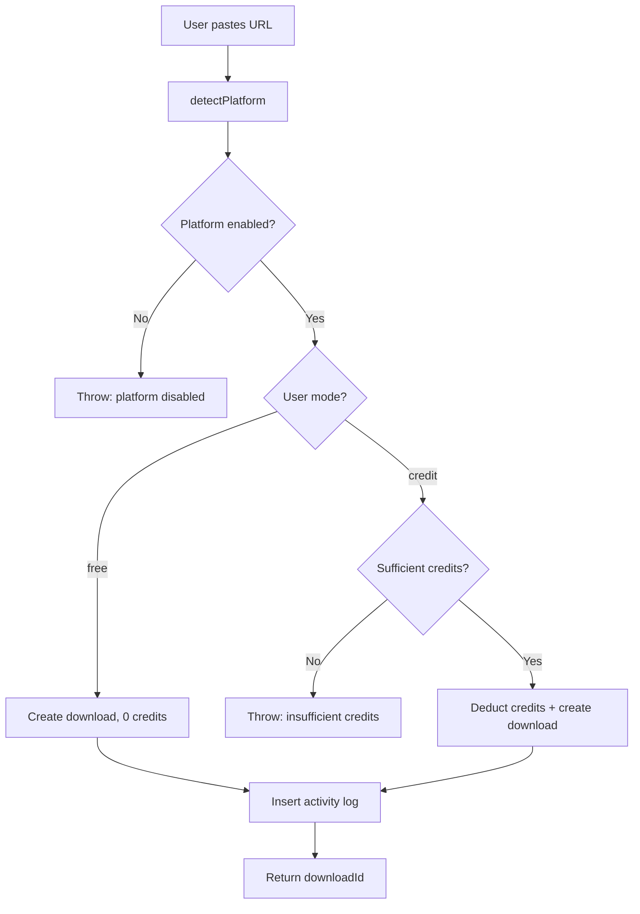
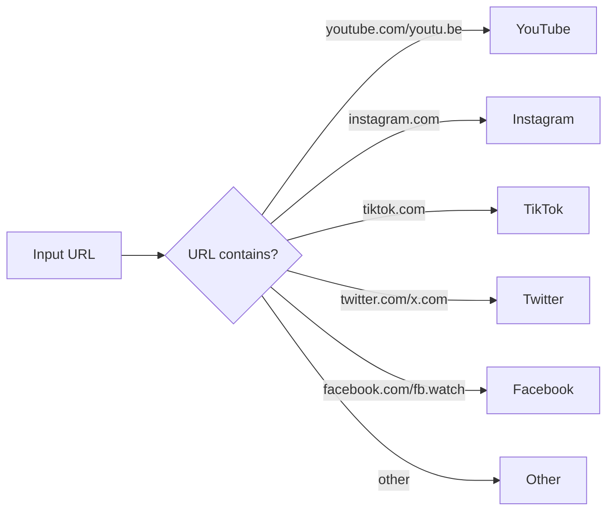

# CRMedia Bot — Downloads Backend

## 1. Goal & Scope

Handles download request creation, platform detection, credit deduction, and download history queries. This is the core user-facing feature — the reason people use CRMedia Bot.

## 2. Architecture Visuals

### Download Request Flow

### Platform Detection

## 3. Code References

**File:** `src/convex/downloads.ts`

| Function | Type | Args | Returns | Description |
|----------|------|------|---------|-------------|
| `createDownload` | mutation | `{ url, quality? }` | `{ downloadId, platform, creditsSpent }` | Create download request |
| `getMyDownloads` | query | `{ limit? }` | `Download[]` | Current user's download history |
| `getAllDownloads` | query | `{ limit?, platform? }` | `Download[]` | Admin: all downloads |
| `detectPlatform` | helper | `url: string` | `string` | Platform from URL |

**Key settings used:** `creditRate`, `${platform}Enabled` (e.g., `youtubeEnabled`)

## 4. Edge Cases & Failure Modes

| Scenario | Behavior | Code Reference |
|----------|----------|----------------|
| Platform disabled | Throws "X downloads are currently disabled" | `downloads.ts` line 30 |
| Insufficient credits | Throws "Insufficient credits. You need X credits" | `downloads.ts` line 36 |
| Free mode user | `creditsNeeded = 0`, no deduction | `downloads.ts` line 27 |
| Unknown platform | `detectPlatform` returns "other" | `downloads.ts` line 12 |
| Admin query non-admin | Returns empty array `[]` | `downloads.ts` line 62 |
| URL with no platform match | Falls through to "other" | `detectPlatform` default |
