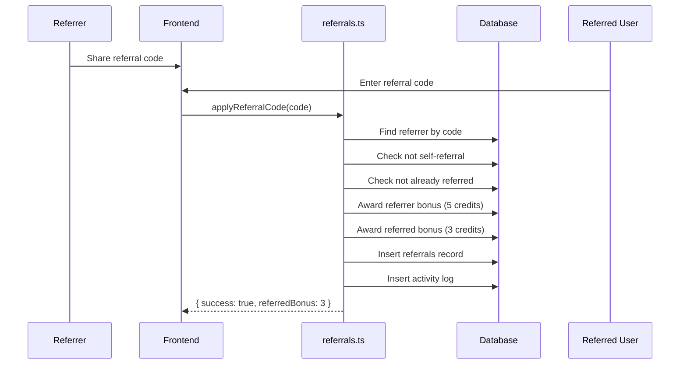
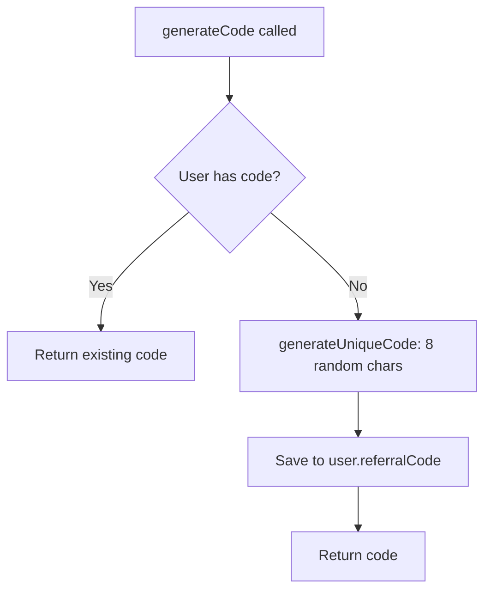

# CRMedia Bot — Referrals Backend

## 1. Goal & Scope

Manages the referral system: code generation, referral application, bonus awards, and referral tracking. Referrals are a key growth lever — both referrer and referred earn bonus credits.

## 2. Architecture Visuals

### Referral Flow

### Code Generation

## 3. Code References

**File:** `src/convex/referrals.ts`

| Function | Type | Args | Returns | Description |
|----------|------|------|---------|-------------|
| `generateCode` | mutation | `{}` | `string` | Generate/get referral code |
| `applyReferralCode` | mutation | `{ referralCode }` | `{ success, referredBonus }` | Apply code, award bonuses |
| `getMyReferrals` | query | `{}` | `{ referralCode, totalReferrals, totalBonusEarned, referredBy }` | Current user's referral info |
| `getAllReferrals` | query | `{ limit? }` | `Referral[]` | Admin: all referrals |

**Key settings used:** `referralBonus` (default 5), `referredBonus` (default 3)

## 4. Edge Cases & Failure Modes

| Scenario | Behavior | Code Reference |
|----------|----------|----------------|
| Self-referral | Throws "Cannot use your own referral code" | `referrals.ts` line 30 |
| Already referred | Throws "You have already been referred" | `referrals.ts` line 34 |
| Invalid code | Throws "Invalid referral code" | `referrals.ts` line 42 |
| Already referred by someone | Throws "You have already been referred" | `referrals.ts` line 48 |
| Admin query non-admin | Returns empty array `[]` | `referrals.ts` line 85 |
| Code collision | Not handled — random 8-char generation | `generateUniqueCode` |
