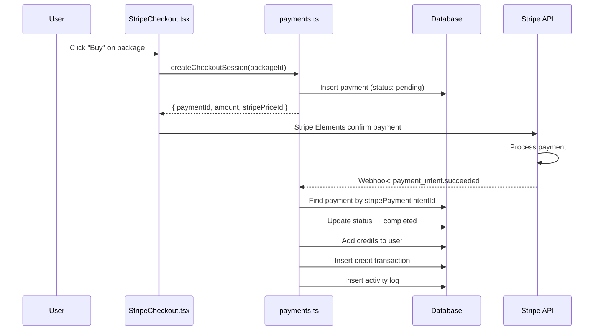
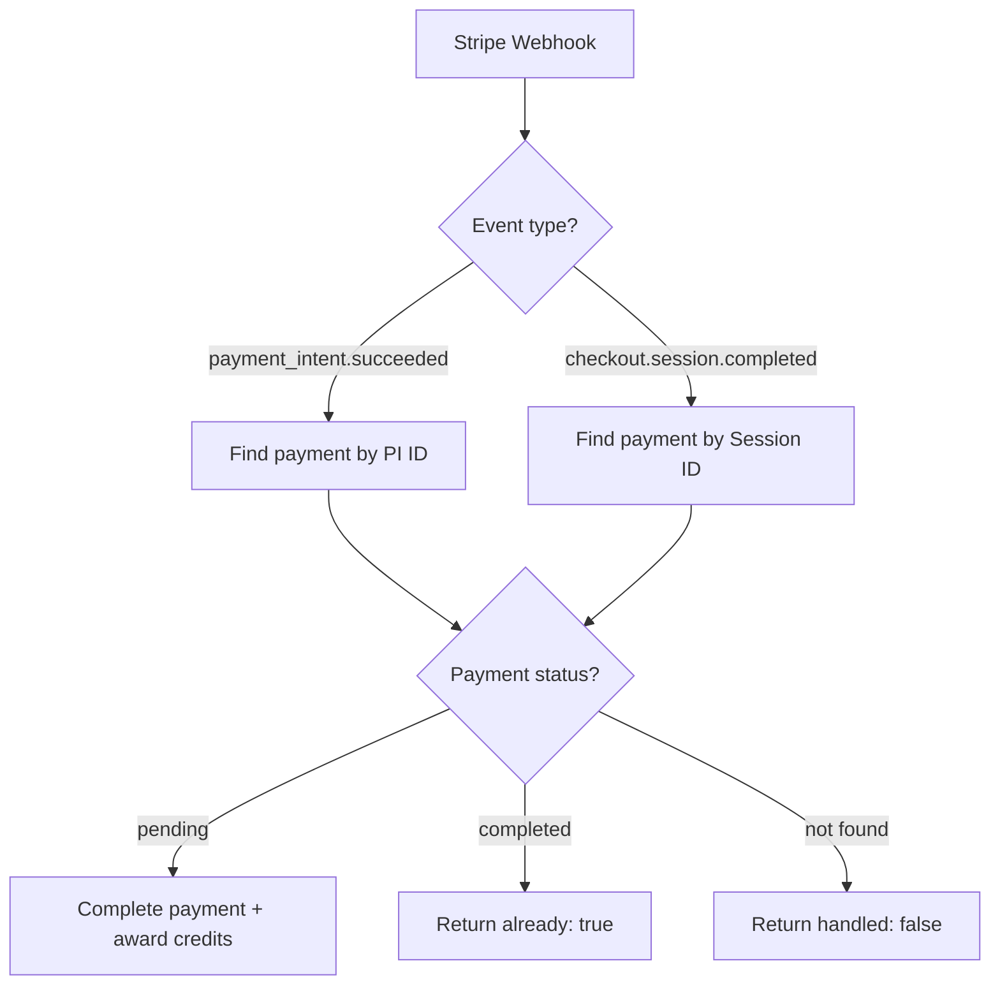

# CRMedia Bot — Payments Backend

## 1. Goal & Scope

Handles Stripe payment integration: checkout session creation, payment confirmation, webhook processing, and payment history. This module bridges the frontend Stripe UI with the credit system.

## 2. Architecture Visuals

### Payment Flow

### Webhook Handling

## 3. Code References

**File:** `src/convex/payments.ts`

| Function | Type | Args | Returns | Description |
|----------|------|------|---------|-------------|
| `createCheckoutSession` | mutation | `{ packageId }` | `{ paymentId, amount, currency, credits, packageName, stripePriceId }` | Create pending payment |
| `confirmPayment` | mutation | `{ paymentId, stripePaymentIntentId?, stripeSessionId? }` | `{ success, newBalance }` or `{ already: true }` | Confirm + award credits |
| `failPayment` | mutation | `{ paymentId, reason? }` | `{ success: true }` | Mark payment as failed |
| `getMyPayments` | query | `{ limit? }` | `Payment[]` | Current user's payment history |
| `getAllPayments` | query | `{ limit?, status? }` | `Payment[]` | Admin: all payments |
| `handleStripeWebhook` | mutation | `{ type, stripePaymentIntentId?, stripeSessionId? }` | `{ success }` or `{ handled: false }` | Process Stripe webhook events |

**File:** `src/convex/http.ts`

| Route | Method | Handler | Description |
|-------|--------|---------|-------------|
| `/api/stripe-webhook` | POST | `httpAction` | Receives Stripe webhooks, calls `handleStripeWebhook` |

## 4. Edge Cases & Failure Modes

| Scenario | Behavior | Code Reference |
|----------|----------|----------------|
| Payment already completed | Returns `{ already: true }` (idempotent) | `payments.ts` line 22 |
| Package not found/inactive | Throws "Package not found or inactive" | `payments.ts` line 12 |
| Webhook signature not verified | Currently simulated — production needs Stripe SDK verification | `http.ts` lines 24-26 |
| Unknown webhook event | Silently ignored, returns `{ received: true }` | `http.ts` switch default |
| User not found during webhook | Returns `{ handled: false }` | `payments.ts` line 45 |
