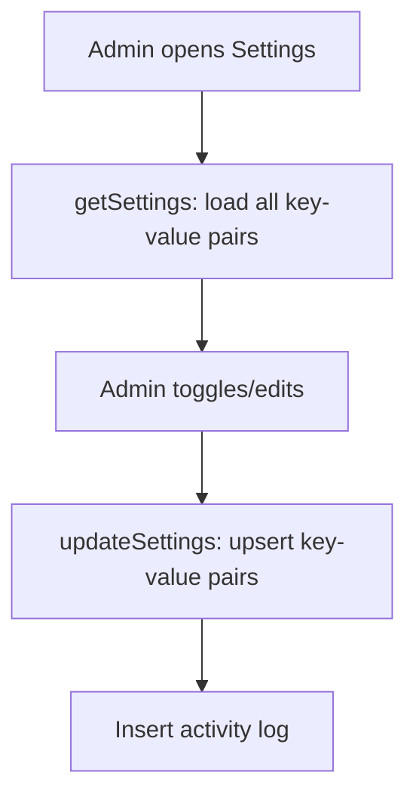
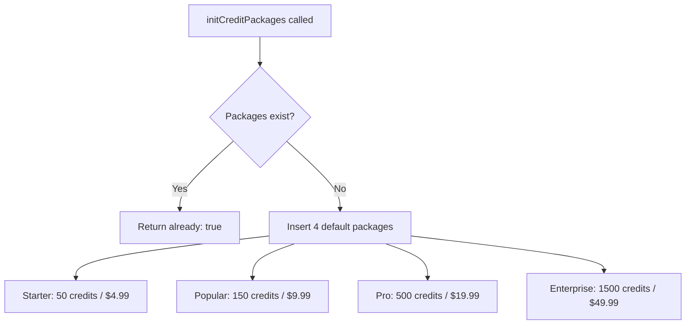
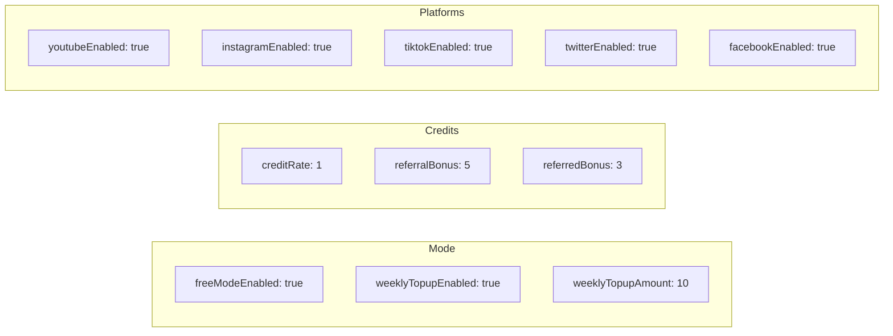

# CRMedia Bot — Settings Backend

## 1. Goal & Scope

Manages bot configuration (key-value settings) and credit packages. Settings control global behavior (mode toggles, credit rates, platform enables) while credit packages define purchasable bundles.

## 2. Architecture Visuals

### Settings Flow

### Credit Package Initialization

### Default Settings

## 3. Code References

**File:** `src/convex/settings.ts`

| Function | Type | Args | Returns | Description |
|----------|------|------|---------|-------------|
| `initSettings` | mutation | `{}` | `{ created, total }` | Seed default settings (idempotent) |
| `getSettings` | query | `{}` | `Record<string, any>` | All settings as key-value map |
| `updateSettings` | mutation | `{ settings: Record<string, any> }` | `{ updated }` | Upsert settings (admin only) |
| `getCreditPackages` | query | `{}` | `CreditPackage[]` | Active credit packages |
| `initCreditPackages` | mutation | `{}` | `{ created }` or `{ already: true }` | Seed default packages |
| `getSetting` | query | `{ key }` | `any` | Single setting value |

**Default settings defined:** `DEFAULT_SETTINGS` constant in `settings.ts` lines 8-24

## 4. Edge Cases & Failure Modes

| Scenario | Behavior | Code Reference |
|----------|----------|----------------|
| Settings already initialized | Skips existing keys, only creates new ones | `initSettings` line 15 |
| Non-admin update | Throws "Not authorized" | `updateSettings` line 24 |
| Packages already exist | Returns `{ already: true }` | `initCreditPackages` line 35 |
| Unknown setting key | Creates new setting with empty description | `updateSettings` line 29 |
| Settings read by other modules | Each module has its own `getSettingsMap()` helper | `credits.ts`, `downloads.ts`, `referrals.ts` |
