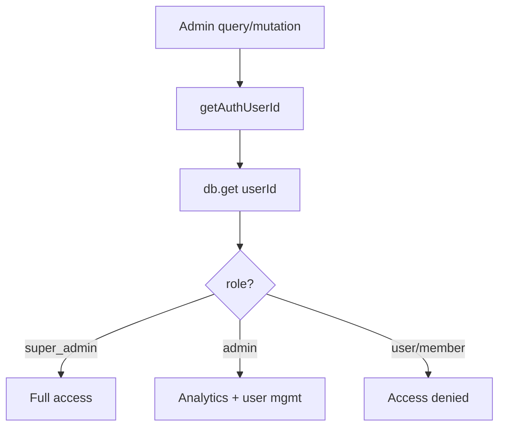
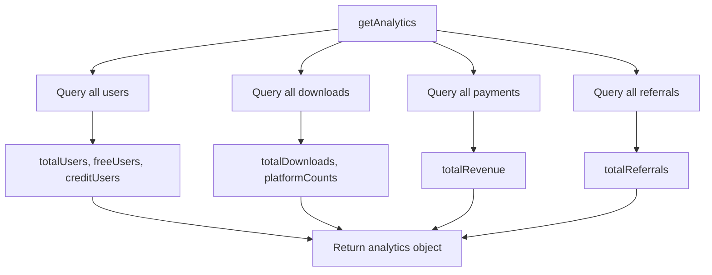

# CRMedia Bot — Admin Backend

## 1. Goal & Scope

Provides admin and super-admin operations: role checking, analytics, user management, credit adjustments, role changes, system config, and activity logs. This is the control plane for the entire platform.

## 2. Architecture Visuals

### Admin Authorization Flow



### Analytics Aggregation



### System Config (Super Admin)

```mermaid
flowchart TD
    A[getSystemConfig] --> B[Check super_admin role]
    B --> C[Query all users]
    B --> D[Query all settings]
    C --> E[Count by role]
    D --> F[Return settings list]
    E --> G[Return { userCount, settingsCount, roles, settings }]
    F --> G
```

## 3. Code References

**File:** `src/convex/admin.ts`

| Function | Type | Args | Returns | Description |
|----------|------|------|---------|-------------|
| `isAdmin` | query | `{}` | `boolean` | Check if current user is admin/super_admin |
| `isSuperAdmin` | query | `{}` | `boolean` | Check if current user is super_admin |
| `getAnalytics` | query | `{}` | `Analytics \| null` | Platform-wide analytics |
| `getAllUsers` | query | `{ limit?, role? }` | `User[]` | List all users (admin only) |
| `adjustUserCredits` | mutation | `{ targetUserId, amount, reason }` | `{ success, newBalance }` | Add/remove credits from user |
| `manageUserRole` | mutation | `{ targetUserId, newRole }` | `{ success }` | Change user role (super_admin only) |
| `getSystemConfig` | query | `{}` | `SystemConfig \| null` | Full system config (super_admin only) |
| `getActivityLogs` | query | `{ limit?, type? }` | `ActivityLog[]` | Query activity logs (admin only) |

### Analytics Object Shape

```typescript
{
  totalUsers: number;
  totalDownloads: number;
  totalRevenue: number;
  totalCreditsInCirculation: number;
  freeUsers: number;
  creditUsers: number;
  totalReferrals: number;
  recentUsers: number;        // users from last 7 days
  platformCounts: Record<string, number>;
  adminCount: number;
}
```

## 4. Edge Cases & Failure Modes

| Scenario | Behavior | Code Reference |
|----------|----------|----------------|
| Non-admin analytics | Returns `null` | `admin.ts` line 25 |
| Non-super-admin system config | Returns `null` | `admin.ts` line 75 |
| Adjust below zero | Throws "Cannot reduce credits below 0" | `admin.ts` line 55 |
| Non-super-admin role change | Throws "Only super admins can manage roles" | `admin.ts` line 65 |
| Target user not found | Throws "Target user not found" | `admin.ts` lines 52, 63 |
| Admin query non-admin | Returns empty array `[]` | `admin.ts` lines 42, 85 |
