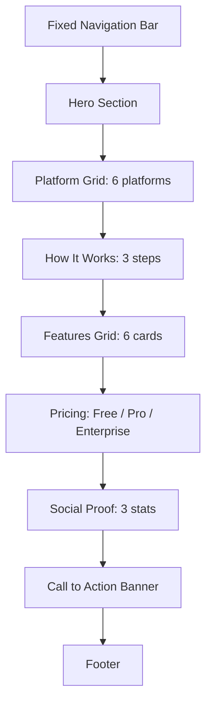

# CRMedia Bot — Landing Page

## 1. Goal & Scope

The public-facing marketing page at `/`. Designed to convert visitors into users with a compelling hero, platform showcase, feature highlights, pricing, social proof, and clear CTAs to auth/dashboard.

## 2. Architecture Visuals

### Page Sections



### Navigation Flow

```mermaid
flowchart LR
    A[Landing /] -->|Click "Get Started"| B[/auth]
    A -->|Click "Dashboard"| C[/dashboard]
    A -->|Scroll| D[Features section]
    D -->|Click "Learn More"| E[Pricing section]
```

## 3. Code References

**File:** `src/pages/Landing.tsx`

| Section | Component/Element | Lines | Description |
|---------|-------------------|-------|-------------|
| Nav | `<nav>` | 25-37 | Fixed top bar with logo, Sign In, Get Started |
| Hero | `<section>` | 39-90 | Title, subtitle, CTA buttons, stats grid |
| Platforms | `platforms` array | 12-17 | YouTube, Instagram, TikTok, Twitter, Facebook, Direct Links |
| How It Works | `steps` array | 24-28 | Sign Up → Paste Link → Download |
| Features | `features` array | 18-23 | Lightning Fast, Free/Premium, Referrals, Payments, Analytics, Multi-Platform |
| Pricing | 3 tiers | 127-185 | Free ($0), Pro ($7.99/150), Enterprise ($19.99/500) |
| Social Proof | 3 stats | 187-207 | 10K+ Users, 500K+ Downloads, 99.9% Uptime |
| CTA | Final section | 209-230 | Gradient banner with "Get Started Free" button |
| Footer | `<footer>` | 232-248 | Logo, links, copyright |

**Animation:** Uses `framer-motion` with `fadeUp` variants for scroll-triggered animations.

## 4. Edge Cases & Failure Modes

| Scenario | Behavior |
|----------|----------|
| Authenticated user clicks "Get Started" | Redirects to `/dashboard` (not `/auth`) |
| Unauthenticated user clicks "Dashboard" | Redirects to `/auth` |
| "Learn More" button | Scrolls to `#features` section smoothly |
| Mobile responsiveness | Uses `sm:`, `md:`, `lg:` breakpoints throughout |
| Dark mode | Uses shadcn/ui CSS variables, works in both themes |
