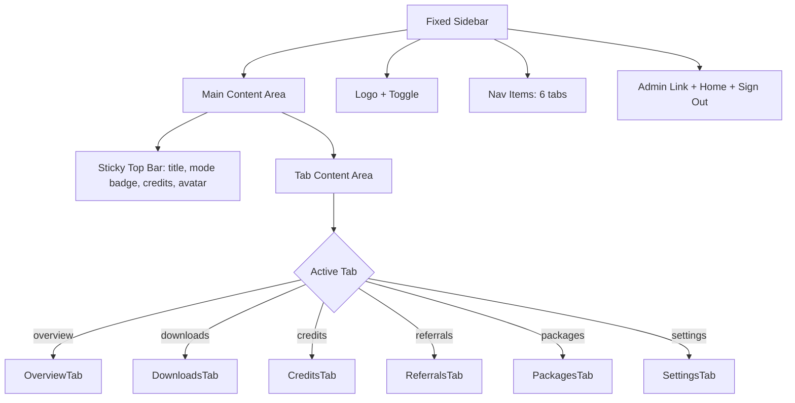
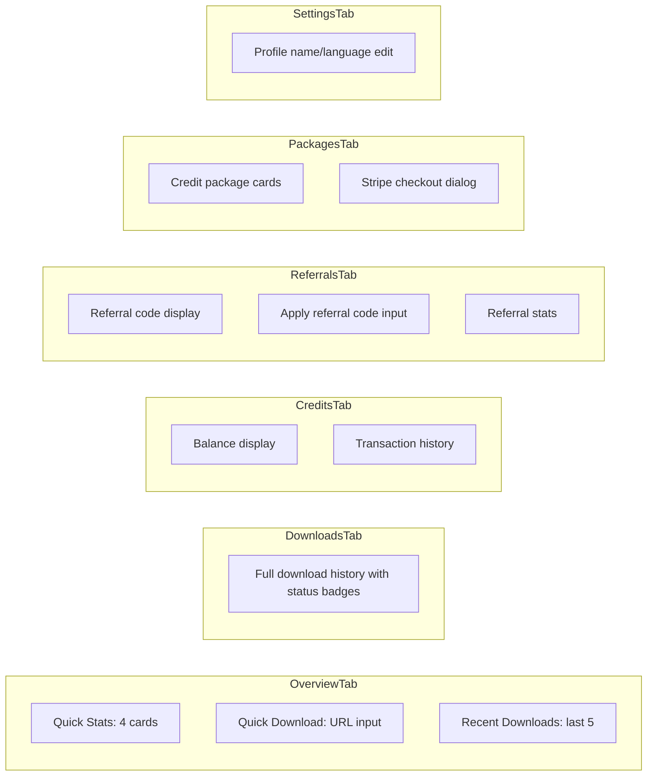
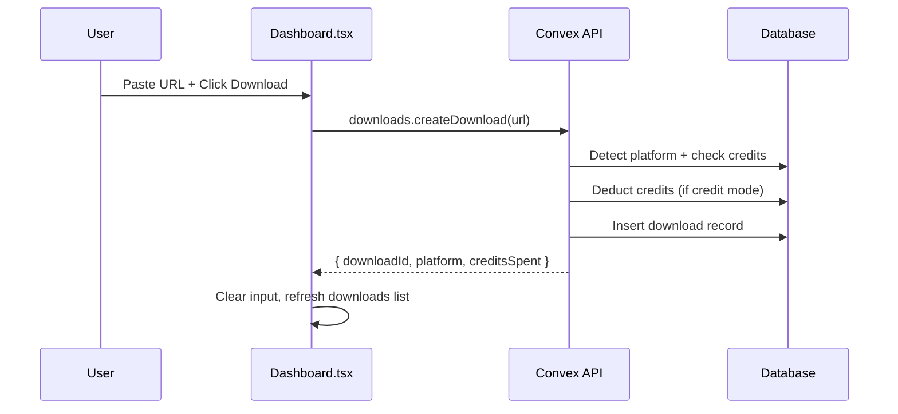

# CRMedia Bot — User Dashboard

## 1. Goal & Scope

The authenticated user's main interface at `/dashboard`. Provides a modern sidebar layout with tabs for overview, downloads, credits, referrals, credit packages (Stripe checkout), and profile settings. This is where users spend most of their time.

## 2. Architecture Visuals

### Dashboard Layout

### Tab Components

### Download Flow from Dashboard

## 3. Code References

**File:** `src/pages/Dashboard.tsx`

| Component | Lines | Description |
|-----------|-------|-------------|
| `Dashboard` (main) | 73-185 | Sidebar layout, auth check, state management |
| `OverviewTab` | 188-260 | Stats grid, quick download, recent downloads |
| `DownloadsTab` | 263-310 | Full download history with platform badges |
| `CreditsTab` | 313-360 | Balance display, transaction history |
| `ReferralsTab` | 363-420 | Referral code, apply code, stats |
| `PackagesTab` | 423-460 | Credit package cards (uses `StripeCheckout` component) |
| `SettingsTab` | 463-500 | Profile name/language edit |

**State variables:** `activeTab`, `sidebarOpen`, `urlInput`, `downloading`, `copiedCode`, `referralInput`, `applyingReferral`, `checkoutPkg`

**Convex hooks used:**
- Queries: `credits.getBalance`, `credits.getTransactions`, `downloads.getMyDownloads`, `referrals.getMyReferrals`, `settings.getCreditPackages`, `users.getProfile`, `admin.isAdmin`
- Mutations: `users.ensureProfile`, `downloads.createDownload`, `credits.switchMode`, `referrals.applyReferralCode`, `users.updateProfile`, `users.touchLastSeen`

## 4. Edge Cases & Failure Modes

| Scenario | Behavior |
|----------|----------|
| Unauthenticated access | Redirects to `/auth` via useEffect |
| Loading state | Shows spinner with "Loading your dashboard..." |
| Download fails | Console error logged, input not cleared |
| Referral code already used | Backend throws error, caught in catch block |
| Copy referral code | Uses `navigator.clipboard.writeText()`, shows checkmark for 2s |
| Sidebar collapsed | Shows icons only (w-16), toggle expands to w-64 |
| Admin link visible | Only shown if `admin.isAdmin` returns true |
| Stripe checkout opens | Dialog overlay with Stripe Elements payment form |
