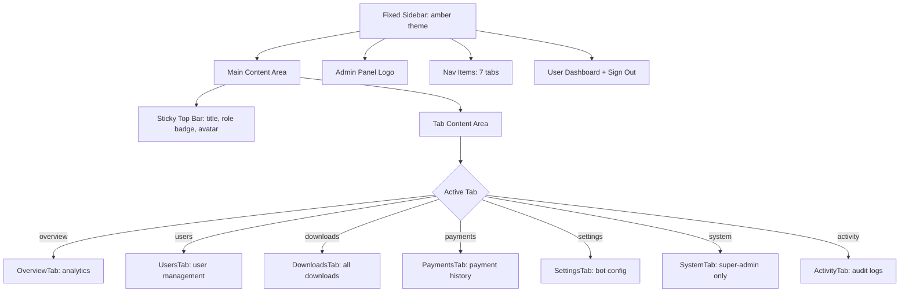
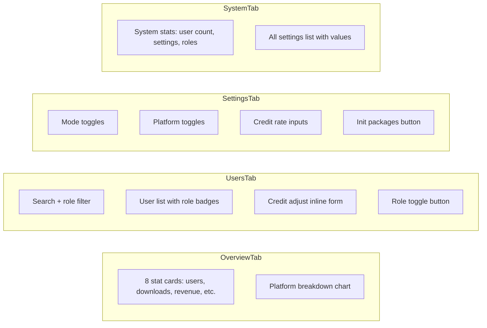
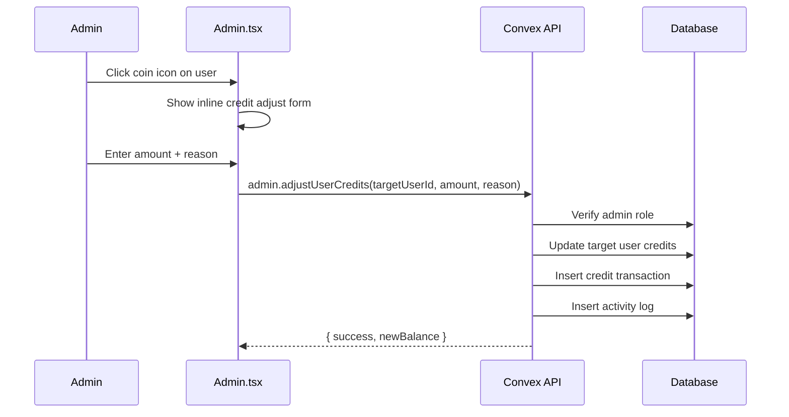

# CRMedia Bot — Admin Dashboard

## 1. Goal & Scope

The admin interface at `/admin`. Provides a sidebar layout with tabs for analytics, user management, downloads, payments, settings, system config (super-admin only), and activity logs. This is the control plane for platform operators.

## 2. Architecture Visuals

### Admin Layout

### Admin Tab Components

### User Management Flow

## 3. Code References

**File:** `src/pages/Admin.tsx`

| Component | Lines | Description |
|-----------|-------|-------------|
| `Admin` (main) | 46-120 | Sidebar layout, auth + admin check, initSettings |
| `OverviewTab` | 123-175 | 8 analytics stat cards, platform breakdown |
| `UsersTab` | 178-260 | Search, role filter, user list, credit adjust, role toggle |
| `DownloadsTab` | 263-300 | All downloads with status badges |
| `PaymentsTab` | 303-360 | Revenue stats, payment history |
| `SettingsTab` | 363-440 | Mode/platform toggles, credit rate inputs, init packages |
| `SystemTab` | 443-490 | System stats, all settings (super-admin only) |
| `ActivityTab` | 493-540 | Activity log with type filter |

**Convex hooks used:**
- Queries: `admin.isAdmin`, `admin.isSuperAdmin`, `admin.getAnalytics`, `admin.getAllUsers`, `downloads.getAllDownloads`, `payments.getAllPayments`, `settings.getSettings`, `admin.getSystemConfig`, `admin.getActivityLogs`
- Mutations: `settings.initSettings`, `admin.adjustUserCredits`, `admin.manageUserRole`, `settings.updateSettings`, `settings.initCreditPackages`

## 4. Edge Cases & Failure Modes

| Scenario | Behavior |
|----------|----------|
| Non-admin accesses /admin | Redirected to `/dashboard` |
| Loading state | Shows "Verifying admin access..." spinner |
| Access denied | Shows card with "Admin privileges required" |
| Super-admin tab hidden | System Config tab hidden for non-super-admins |
| Credit adjust form | Inline expand/collapse per user row |
| Role toggle | Confirms via `window.confirm()` before changing |
| Settings save | Shows saving state, catches errors silently |
| Activity log type filter | Client-side filter on top of server query |
