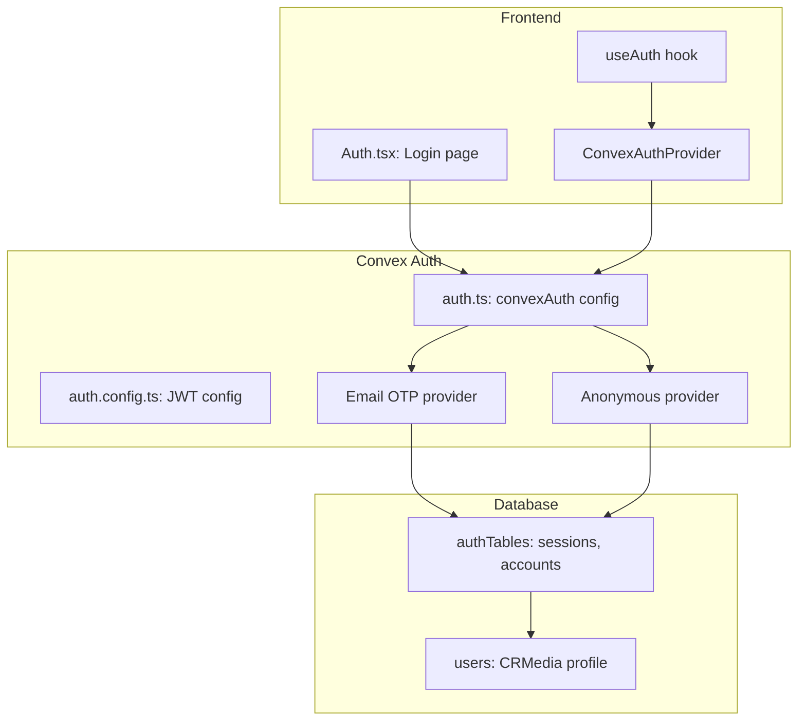
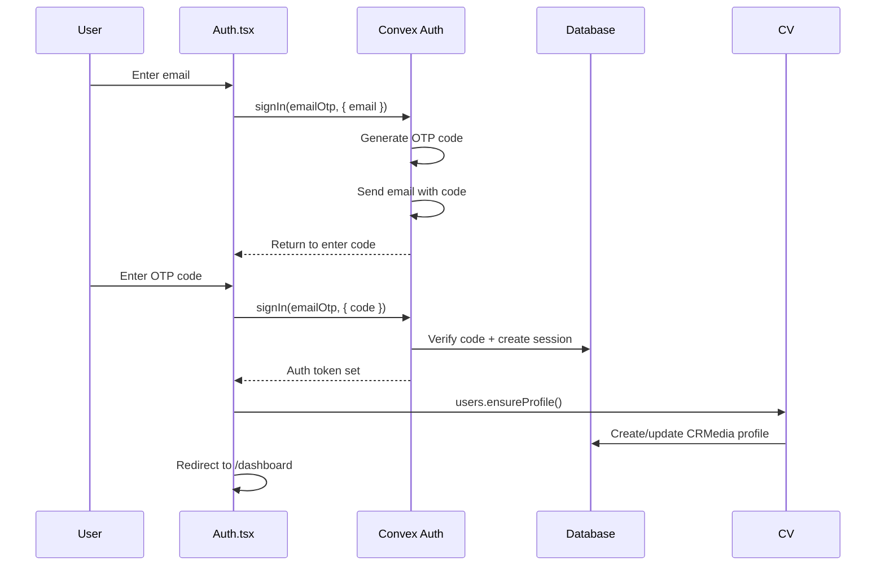
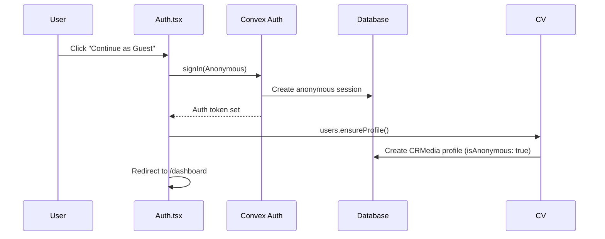

# CRMedia Bot — Authentication Flow

## 1. Goal & Scope

Handles user authentication via Convex Auth with two providers: Email OTP (primary) and Anonymous (guest). Auth is the gateway — every authenticated feature depends on it working correctly.

## 2. Architecture Visuals

### Auth Architecture



### Email OTP Login Flow



### Anonymous Login Flow



## 3. Code References

| File | Purpose | Key Exports |
|------|---------|-------------|
| `src/convex/auth.ts` | Convex Auth configuration | `auth`, `signIn`, `signOut`, `store`, `isAuthenticated` |
| `src/convex/auth.config.ts` | JWT issuer config | Default auth config with `customJwt` provider |
| `src/convex/auth/emailOtp.ts` | Email OTP provider | Custom email OTP implementation |
| `src/hooks/use-auth.ts` | React hook for auth state | `useAuth()` → `{ isLoading, isAuthenticated, user, signIn, signOut }` |
| `src/pages/Auth.tsx` | Login/signup page UI | Email input, OTP verification, anonymous button |

### Auth Provider Chain

```typescript
// src/convex/auth.ts
export const { auth, signIn, signOut, store, isAuthenticated } = convexAuth({
  providers: [emailOtp, Anonymous],
});
```

## 4. Edge Cases & Failure Modes

| Scenario | Behavior | Code Reference |
|----------|----------|----------------|
| Expired OTP code | Convex Auth returns error, user retries | `auth/emailOtp.ts` |
| Anonymous user upgrades | Profile already exists, `ensureProfile` is idempotent | `users.ts` line 17 |
| Auth token expired | Convex handles refresh automatically | `@convex-dev/auth` |
| Multiple tabs | Each tab has independent auth state | Convex Auth behavior |
| `VLY_CONVEX_AUTH_ISSUER` not set | Falls back to `CONVEX_SITE_URL` or localhost | `auth.config.ts` line 5 |
