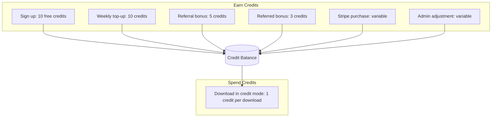
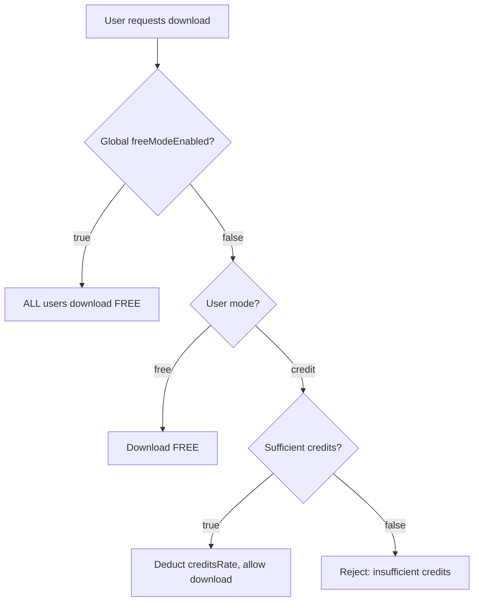
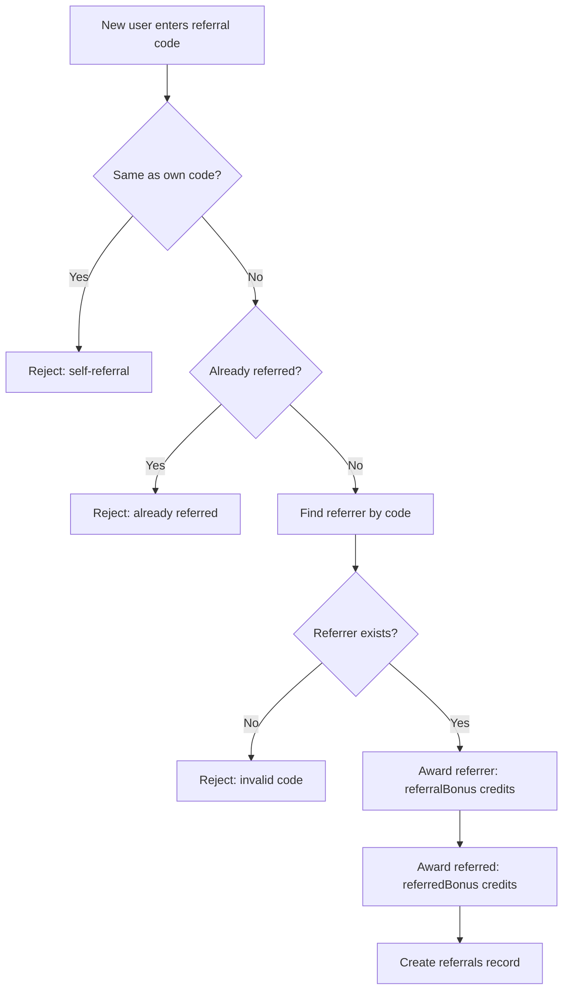
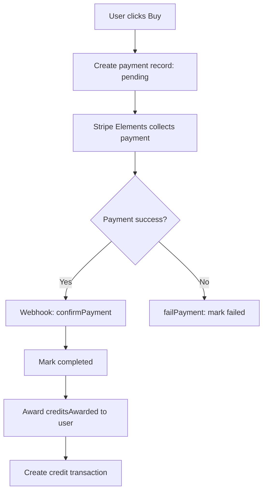

# CRMedia Bot — Business Logic

## 1. Goal & Scope

Documents the core business rules governing credit economics, download modes, referral bonuses, payment processing, and admin operations. These rules are the source of truth for product behavior.

## 2. Architecture Visuals

### Credit Economy

### Mode Decision Tree

### Referral Bonus Rules

### Payment Processing Rules

## 3. Code References

| Rule | Source File | Function/Constant |
|------|------------|-------------------|
| Free mode bypass | `src/convex/downloads.ts` | `createDownload` line 27: `creditsNeeded = user.mode === "free" ? 0 : creditRate` |
| Credit rate | `src/convex/settings.ts` | `DEFAULT_SETTINGS.creditRate: 1` |
| Weekly top-up amount | `src/convex/settings.ts` | `DEFAULT_SETTINGS.weeklyTopupAmount: 10` |
| Referral bonus | `src/convex/settings.ts` | `DEFAULT_SETTINGS.referralBonus: 5` |
| Referred bonus | `src/convex/settings.ts` | `DEFAULT_SETTINGS.referredBonus: 3` |
| New user credits | `src/convex/users.ts` | `ensureProfile` line 22: `credits: 10` |
| Platform enables | `src/convex/settings.ts` | `DEFAULT_SETTINGS.{platform}Enabled: true` |
| Credit packages | `src/convex/settings.ts` | `initCreditPackages` lines 37-42 |

### Default Credit Packages

| Package | Credits | Price | Badge |
|---------|---------|-------|-------|
| Starter | 50 | $4.99 | — |
| Popular | 150 | $9.99 | "Best Value" |
| Pro | 500 | $19.99 | "Most Credits" |
| Enterprise | 1500 | $49.99 | "Bulk" |

## 4. Edge Cases & Failure Modes

| Scenario | Rule | Enforcement |
|----------|------|-------------|
| Free mode + global enabled | User always downloads free regardless of mode | `downloads.ts` line 27 |
| Credit mode + zero credits | Reject with descriptive error | `downloads.ts` line 36 |
| Weekly top-up already done | Skip if `weeklyTopupLastAt` < 7 days | `credits.ts` line 38 |
| Referral code not found | Throw "Invalid referral code" | `referrals.ts` line 42 |
| Payment idempotency | `confirmPayment` returns `{ already: true }` | `payments.ts` line 22 |
| Admin adjusts below zero | Throw "Cannot reduce credits below 0" | `credits.ts` line 49 |
| Platform disabled globally | Throw descriptive error | `downloads.ts` line 30 |
