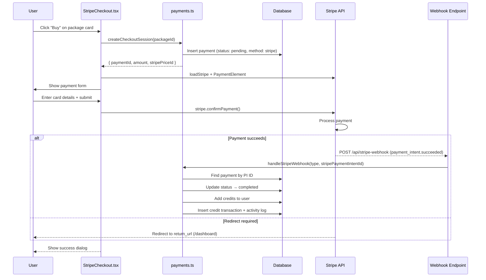

# CRMedia Bot — Stripe Integration

## 1. Goal & Scope

Integrates Stripe for credit package purchases. Users buy credits via Stripe Checkout/Elements, payments are confirmed via webhooks, and credits are awarded atomically. This is the revenue engine of the platform.

## 2. Architecture Visuals

### End-to-End Payment Flow



### Webhook Processing

```mermaid
flowchart TD
    A[Stripe Webhook POST] --> B[Parse JSON body]
    B --> C{Event type?}
    C -->|payment_intent.succeeded| D[Find payment by stripePaymentIntentId]
    C -->|checkout.session.completed| E[Find payment by stripeSessionId]
    C -->|other| F[Return { received: true }]
    D --> G{Payment found + pending?}
    E --> G
    G -->|Yes| H[Complete payment + award credits]
    G -->|No| I[Return { handled: false }]
    H --> J[Return { received: true }]
```

## 3. Code References

| File | Component | Key Items |
|------|-----------|-----------|
| `src/convex/payments.ts` | Backend | `createCheckoutSession`, `confirmPayment`, `handleStripeWebhook` |
| `src/convex/http.ts` | Webhook route | `/api/stripe-webhook` POST endpoint |
| `src/components/StripeCheckout.tsx` | Frontend | `StripeCheckout` dialog, `CheckoutForm` with Stripe Elements |
| `src/convex/settings.ts` | Config | `stripePublishableKey`, `siteUrl` settings |

### Environment Variables

| Variable | Required | Where Used |
|----------|----------|------------|
| `STRIPE_SECRET_KEY` | Yes (server) | `http.ts` webhook verification |
| `VITE_STRIPE_PUBLISHABLE_KEY` | Yes (client) | `StripeCheckout.tsx` → `loadStripe()` |
| `STRIPE_WEBHOOK_SECRET` | Yes (server) | `http.ts` webhook signature verification |

### Stripe Element Configuration

```typescript
// src/components/StripeCheckout.tsx
appearance: {
  theme: "night",
  variables: {
    colorPrimary: "#7c3aed",
    colorBackground: "#1e1b2e",
    colorText: "#f8fafc",
  },
}
```

## 4. Edge Cases & Failure Modes

| Scenario | Behavior | Code Reference |
|----------|----------|----------------|
| Payment already completed | `confirmPayment` returns `{ already: true }` | `payments.ts` line 22 |
| Package inactive | Throws "Package not found or inactive" | `payments.ts` line 12 |
| Webhook signature not verified | Currently simulated — **production risk** | `http.ts` lines 24-26 |
| Unknown webhook event | Silently accepted, returns `{ received: true }` | `http.ts` switch default |
| User closes payment dialog | `onOpenChange(false)` clears state | `StripeCheckout.tsx` |
| Stripe publishable key missing | `loadStripe("")` — Stripe.js fails gracefully | `StripeCheckout.tsx` line 12 |
| Redirect after payment | `return_url` points to `/dashboard` | `StripeCheckout.tsx` line 52 |

### Production Setup Required

1. Create Stripe account → get API keys
2. Set `STRIPE_SECRET_KEY`, `VITE_STRIPE_PUBLISHABLE_KEY` in Keys/API keys tab
3. Create webhook endpoint pointing to `{CONVEX_URL}/api/stripe-webhook`
4. Listen for `payment_intent.succeeded` and `checkout.session.completed` events
5. Set `STRIPE_WEBHOOK_SECRET` with the webhook signing secret
6. **Enable webhook signature verification** in `http.ts` (currently commented out)
